 # Experiment 3: Regression Analysis using Linear and Regularized Models
To implement linear and regularized regression models for predicting a continuous target variable,
evaluate their performance using multiple metrics, visualize model behavior, and analyze overfitting,
underfitting, and bias–variance characteristics.


## 1. Dataset Description and EDA


```python
import pandas as pd
import numpy as np
import seaborn as sns
import matplotlib.pyplot as plt
import scipy.stats as stats

from scipy.stats import zscore
from sklearn.preprocessing import StandardScaler


def eda(df):
    print("-" * 60)
    print("DATASET OVERVIEW")

    print("Dimensions:", df.shape)
    print("\nFirst 5 rows:")
    print(df.head())

    print("\nColumns:")
    for col in df.columns:
        print(col)

    dup = df.duplicated().sum()

    print("\nDuplicate rows:", dup)

    if dup > 0:
        df = df.drop_duplicates()
        print("Duplicate rows removed.")

    print("-" * 60)
    print("MISSING VALUE ANALYSIS")

    missing = df.isnull().sum()
    missing_percentage = (df.isnull().sum() / len(df)) * 100
    print("\n")
    print(f"Number of missing values: {missing}")

    # Plot missing values
    plt.figure(figsize=(10, 5))
    plt.bar(df.columns, df.isnull().sum())
    plt.xlabel("Columns")
    plt.ylabel("Number of Missing Values")
    plt.title("Missing Values")
    plt.xticks(rotation=45, ha="right")
    plt.tight_layout()
    plt.show()

    
    #Remove columns with > 50% missing values
    
    missing_threshold = 50

    columns_to_drop = missing_percentage[missing_percentage > missing_threshold].index.tolist()

    if columns_to_drop:
        print("\nColumns removed because of excessive missing values:")
        for col in columns_to_drop: 
            print("column: " + col + " missing percentage: " + missing_percentage[col])
        df = df.drop(columns=columns_to_drop)

    else:
        print("\nNo columns have more than 50% missing values.")

    #Remove constant columns

    constant_columns = []    

    for col in df.columns:
            if df[col].nunique(dropna=False) <= 1:
                constant_columns.append(col)

    if constant_columns:
        print("\nConstant columns removed:")
        for col in constant_columns:
            print(col)
        df = df.drop(columns=constant_columns)

 
    #Seperate numerical and categorical features

    num_cols = df.select_dtypes(include=np.number).columns.tolist()

    cat_cols = df.select_dtypes(include=["object", "category", "string", "bool"]).columns.tolist()

    print("\nNumerical columns:")
    print(num_cols)

    print("\nCategorical columns:")
    print(cat_cols)

    
    #Missing value imputation
    
    print("-" * 60)
    print("MISSING VALUE IMPUTATION")

    for col in num_cols:
        if df[col].isnull().sum() > 0:
            median_value = df[col].median()
            df[col] = df[col].fillna(median_value)

    for col in cat_cols:
        if df[col].isnull().sum() > 0:
            mode = df[col].mode()
            if not mode.empty:
                mode_value = mode[0]
                df[col] = df[col].fillna(mode_value)

    print("Missing values imputed!")

    
    # outlier handling
    

    print("-" * 60)
    print("OUTLIER DETECTION")

    
    outlier_percentage_threshold = 15

    for col in num_cols:

        Q1 = df[col].quantile(0.25)
        Q3 = df[col].quantile(0.75)
        IQR = Q3 - Q1
        lower_bound = Q1 - 1.5 * IQR
        upper_bound = Q3 + 1.5 * IQR

        outlier_df = (
            (df[col] < lower_bound) |
            (df[col] > upper_bound)
        )
        out_cnt = outlier_df.sum()
        outlier_percentage = (out_cnt / len(df)) * 100
        print(f"{col}: {out_cnt} outliers, percentage: {outlier_percentage}")

        if outlier_percentage == 0:
            print("No outliers detected.")

        elif outlier_percentage <= outlier_percentage_threshold:
            median_value = df[col].median()
            df.loc[outlier_df, col] = median_value

            print("Few outliers detected.")
            print(f"Replaced with median ({median_value}).")

        elif outlier_percentage >= outlier_percentage_threshold:

            df.loc[df[col] < lower_bound, col] = lower_bound
            df.loc[df[col] > upper_bound, col] = upper_bound

            print("Moderate outliers detected.")
            print("Values changed to IQR boundaries")

    print("-" * 60)
    print("NUMERICAL FEATURES VISUALIZATION")
    for col in num_cols:
        fig, axes = plt.subplots(1, 2, figsize=(12, 4))

        sns.histplot(df[col], kde=True, ax=axes[0])
        axes[0].set_title(f"{col} - Distribution")
        axes[0].set_xlabel(col)

        sns.boxplot(x=df[col], ax=axes[1])
        axes[1].set_title(f"{col} - Boxplot")
        axes[1].set_xlabel(col)

        plt.tight_layout()
        plt.show()

    # Numerical feature analysis

    print("-" * 60)
    print("NUMERICAL FEATURE TRANSFORMATION")

    for col in num_cols:
        skewness = df[col].skew()
        print(f"{col}: skewness = {skewness}")
        if abs(skewness) > 1:
            if (df[col] >= 0).all():
                df[col] = np.log1p(df[col])
                print("Highly skewed and non-negative.")
                print("Applied log1p transformation.")
            else:
                scaler = StandardScaler()
                df[[col]] = scaler.fit_transform(df[[col]])

                print("Highly skewed but contains negative values. Applied StandardScaler.")
        else:
            scaler = StandardScaler()
            df[[col]] = scaler.fit_transform(df[[col]])
            print("Distribution is reasonably symmetric.")
            print("Applied StandardScaler.")

    #Categorical feature analysis

    print("-" * 60)
    print("CATEGORICAL FEATURE ANALYSIS")

    for col in cat_cols:
        counts = df[col].value_counts()
        if len(counts) > 30:
            print(f"Skipping {col} because it has too many categories.")
            continue
        plt.figure(figsize=(8, 5))

        sns.countplot(
            data=df,
            x=col,
            order=counts.index
        )

        plt.title(f"Count Plot - {col}")
        plt.xticks(rotation=45, ha="right")
        plt.tight_layout()
        plt.show()

    
    # Encode categorical values
    
    print("-" * 60)
    print("CATEGORICAL ENCODING")

    for col in cat_cols:
        unique_count = df[col].nunique()
        if unique_count > 30:
            print(f"Skipping {col} because it has too many categories.")
            continue
        if unique_count == 2:
            values = df[col].unique()
            mapping = {values[0]: 0, values[1]: 1}
            df[col] = df[col].map(mapping)
            print(f"{col}: Binary encoding -> {mapping}")

        else:

            dummies = pd.get_dummies(df[col], prefix=col, drop_first=True, dtype=int)
            df = pd.concat([df.drop(columns=[col]), dummies],axis=1)
            print(f"{col}: One-hot encoded ")
            print(f"{unique_count} categories")


    # Final dataset

    print("-" * 60)
    print("FINAL DATASET")

    print("Final dimensions:", df.shape)

    print("Remaining columns:")
    print(df.columns.tolist())

    print("Remaining missing values:")
    print(df.isnull().sum())

    print("Final dataframe:")
    print(df.head())

    return df
```


```python
df = pd.read_csv("train.csv")
df = eda(df)
```

    ------------------------------------------------------------
    DATASET OVERVIEW
    Dimensions: (30000, 24)
    
    First 5 rows:
      Customer ID               Name Gender  Age  Income (USD) Income Stability  \
    0     C-36995   Frederica Shealy      F   56       1933.05              Low   
    1     C-33999  America Calderone      M   32       4952.91              Low   
    2      C-3770      Rosetta Verne      F   65        988.19             High   
    3     C-26480         Zoe Chitty      F   65           NaN             High   
    4     C-23459       Afton Venema      F   31       2614.77              Low   
    
      Profession     Type of Employment    Location  Loan Amount Request (USD)  \
    0    Working            Sales staff  Semi-Urban                   72809.58   
    1    Working                    NaN  Semi-Urban                   46837.47   
    2  Pensioner                    NaN  Semi-Urban                   45593.04   
    3  Pensioner                    NaN       Rural                   80057.92   
    4    Working  High skill tech staff  Semi-Urban                  113858.89   
    
       ...  Credit Score No. of Defaults Has Active Credit Card  Property ID  \
    0  ...        809.44               0                    NaN          746   
    1  ...        780.40               0            Unpossessed          608   
    2  ...        833.15               0            Unpossessed          546   
    3  ...        832.70               1            Unpossessed          890   
    4  ...        745.55               1                 Active          715   
    
       Property Age  Property Type Property Location  Co-Applicant  \
    0       1933.05              4             Rural             1   
    1       4952.91              2             Rural             1   
    2        988.19              2             Urban             0   
    3           NaN              2        Semi-Urban             1   
    4       2614.77              4        Semi-Urban             1   
    
       Property Price  Loan Sanction Amount (USD)  
    0       119933.46                    54607.18  
    1        54791.00                    37469.98  
    2        72440.58                    36474.43  
    3       121441.51                    56040.54  
    4       208567.91                    74008.28  
    
    [5 rows x 24 columns]
    
    Columns:
    Customer ID
    Name
    Gender
    Age
    Income (USD)
    Income Stability
    Profession
    Type of Employment
    Location
    Loan Amount Request (USD)
    Current Loan Expenses (USD)
    Expense Type 1
    Expense Type 2
    Dependents
    Credit Score
    No. of Defaults
    Has Active Credit Card
    Property ID
    Property Age
    Property Type
    Property Location
    Co-Applicant
    Property Price
    Loan Sanction Amount (USD)
    
    Duplicate rows: 0
    ------------------------------------------------------------
    MISSING VALUE ANALYSIS
    
    
    Number of missing values: Customer ID                       0
    Name                              0
    Gender                           53
    Age                               0
    Income (USD)                   4576
    Income Stability               1683
    Profession                        0
    Type of Employment             7270
    Location                          0
    Loan Amount Request (USD)         0
    Current Loan Expenses (USD)     172
    Expense Type 1                    0
    Expense Type 2                    0
    Dependents                     2493
    Credit Score                   1703
    No. of Defaults                   0
    Has Active Credit Card         1566
    Property ID                       0
    Property Age                   4850
    Property Type                     0
    Property Location               356
    Co-Applicant                      0
    Property Price                    0
    Loan Sanction Amount (USD)      340
    dtype: int64
    


    
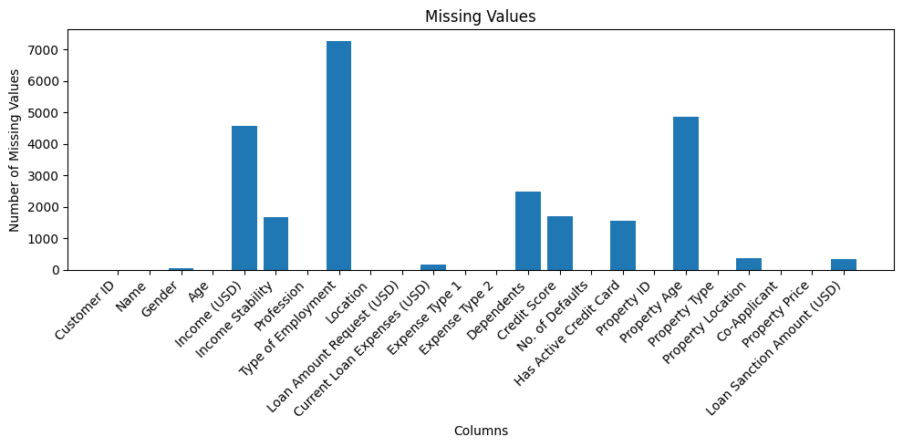
    


    
    No columns have more than 50% missing values.
    
    Numerical columns:
    ['Age', 'Income (USD)', 'Loan Amount Request (USD)', 'Current Loan Expenses (USD)', 'Dependents', 'Credit Score', 'No. of Defaults', 'Property ID', 'Property Age', 'Property Type', 'Co-Applicant', 'Property Price', 'Loan Sanction Amount (USD)']
    
    Categorical columns:
    ['Customer ID', 'Name', 'Gender', 'Income Stability', 'Profession', 'Type of Employment', 'Location', 'Expense Type 1', 'Expense Type 2', 'Has Active Credit Card', 'Property Location']
    ------------------------------------------------------------
    MISSING VALUE IMPUTATION
    Missing values imputed!
    ------------------------------------------------------------
    OUTLIER DETECTION
    Age: 0 outliers, percentage: 0.0
    No outliers detected.
    Income (USD): 1874 outliers, percentage: 6.246666666666666
    Few outliers detected.
    Replaced with median (2222.435).
    Loan Amount Request (USD): 752 outliers, percentage: 2.506666666666667
    Few outliers detected.
    Replaced with median (75128.075).
    Current Loan Expenses (USD): 874 outliers, percentage: 2.9133333333333336
    Few outliers detected.
    Replaced with median (375.205).
    Dependents: 432 outliers, percentage: 1.44
    Few outliers detected.
    Replaced with median (2.0).
    Credit Score: 0 outliers, percentage: 0.0
    No outliers detected.
    No. of Defaults: 5818 outliers, percentage: 19.393333333333334
    Moderate outliers detected.
    Values changed to IQR boundaries
    Property ID: 0 outliers, percentage: 0.0
    No outliers detected.
    Property Age: 1930 outliers, percentage: 6.433333333333334
    Few outliers detected.
    Replaced with median (2223.25).
    Property Type: 0 outliers, percentage: 0.0
    No outliers detected.
    Co-Applicant: 4484 outliers, percentage: 14.946666666666667
    Few outliers detected.
    Replaced with median (1.0).
    Property Price: 863 outliers, percentage: 2.8766666666666665
    Few outliers detected.
    Replaced with median (109993.61).
    Loan Sanction Amount (USD): 453 outliers, percentage: 1.51
    Few outliers detected.
    Replaced with median (35209.395000000004).
    ------------------------------------------------------------
    NUMERICAL FEATURES VISUALIZATION
    


    
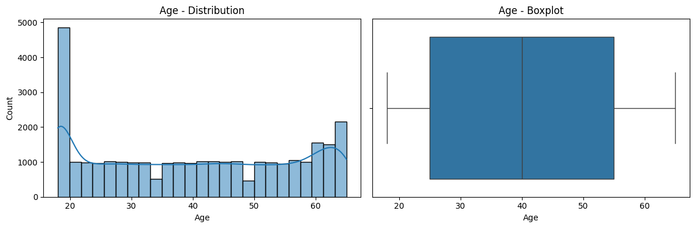
    


    
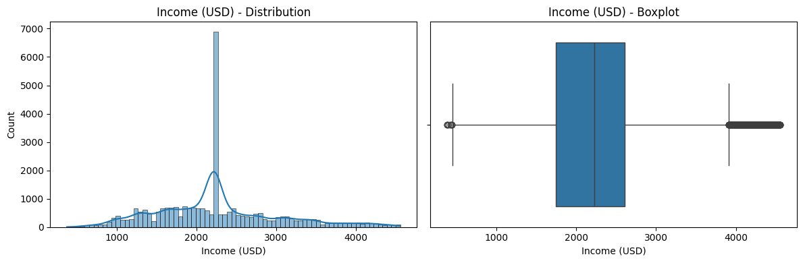
    


    
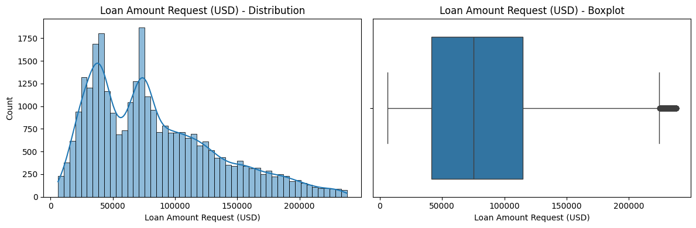
    


    
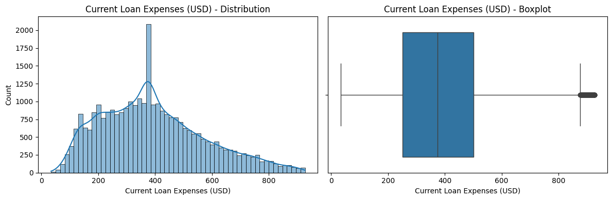
    


    
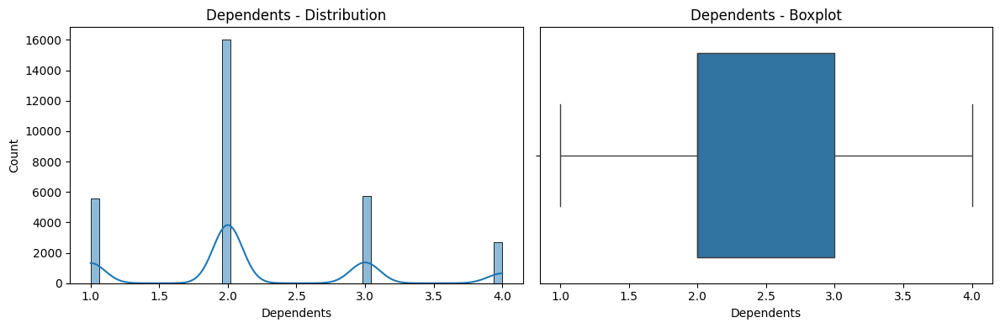
    


    
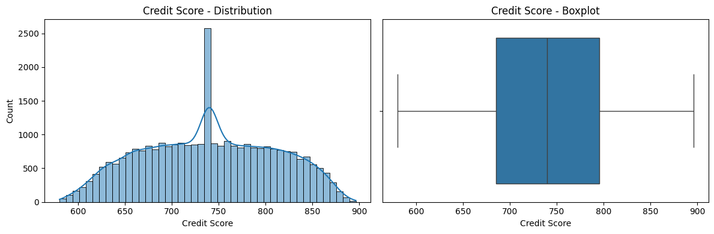
    


    

    


    
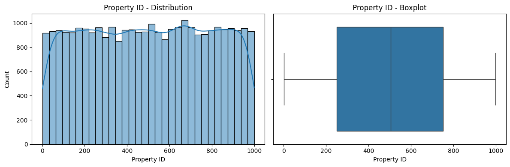
    


    
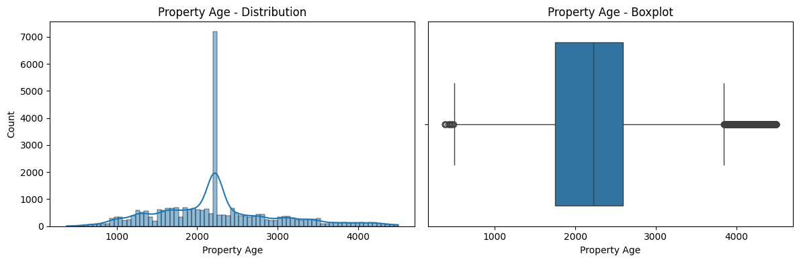
    


    
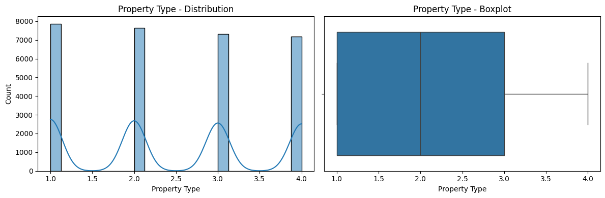
    


    
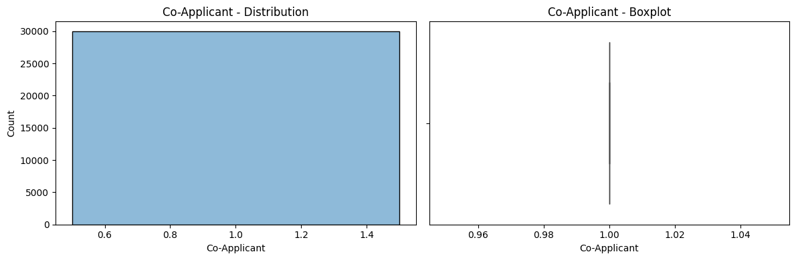
    


    
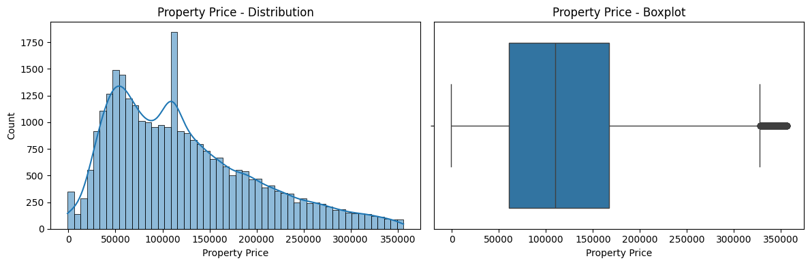
    


    
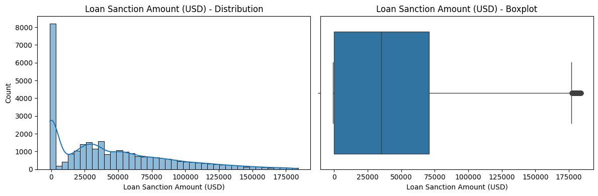
    


    ------------------------------------------------------------
    NUMERICAL FEATURE TRANSFORMATION
    Age: skewness = 0.046093801598670575
    Distribution is reasonably symmetric.
    Applied StandardScaler.
    Income (USD): skewness = 0.6050985571994248
    Distribution is reasonably symmetric.
    Applied StandardScaler.
    Loan Amount Request (USD): skewness = 0.8144025243752381
    Distribution is reasonably symmetric.
    Applied StandardScaler.
    Current Loan Expenses (USD): skewness = 0.5616744332800275
    Distribution is reasonably symmetric.
    Applied StandardScaler.
    Dependents: skewness = 0.560014326304551
    Distribution is reasonably symmetric.
    Applied StandardScaler.
    Credit Score: skewness = -0.02069683024344066
    Distribution is reasonably symmetric.
    Applied StandardScaler.
    No. of Defaults: skewness = 0.0
    Distribution is reasonably symmetric.
    Applied StandardScaler.
    Property ID: skewness = -0.010519189724274057
    Distribution is reasonably symmetric.
    Applied StandardScaler.
    Property Age: skewness = 0.5838257164690455
    Distribution is reasonably symmetric.
    Applied StandardScaler.
    Property Type: skewness = 0.05107020903989084
    Distribution is reasonably symmetric.
    Applied StandardScaler.
    Co-Applicant: skewness = 0.0
    Distribution is reasonably symmetric.
    Applied StandardScaler.
    Property Price: skewness = 0.8300184734536875
    Distribution is reasonably symmetric.
    Applied StandardScaler.
    Loan Sanction Amount (USD): skewness = 0.9100091995255744
    Distribution is reasonably symmetric.
    Applied StandardScaler.
    ------------------------------------------------------------
    CATEGORICAL FEATURE ANALYSIS
    Skipping Customer ID because it has too many categories.
    Skipping Name because it has too many categories.
    


    
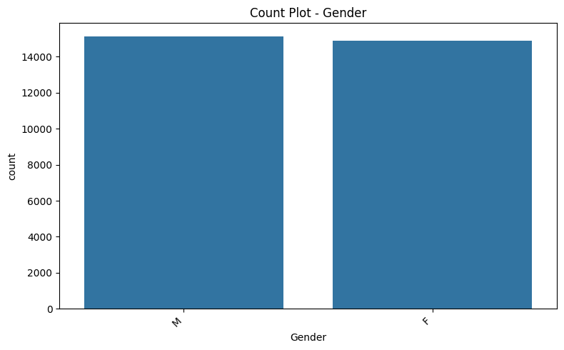
    


    
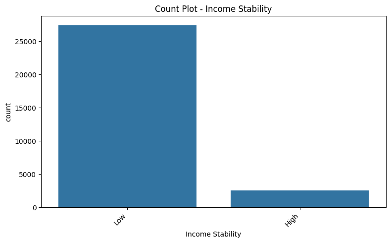
    


    
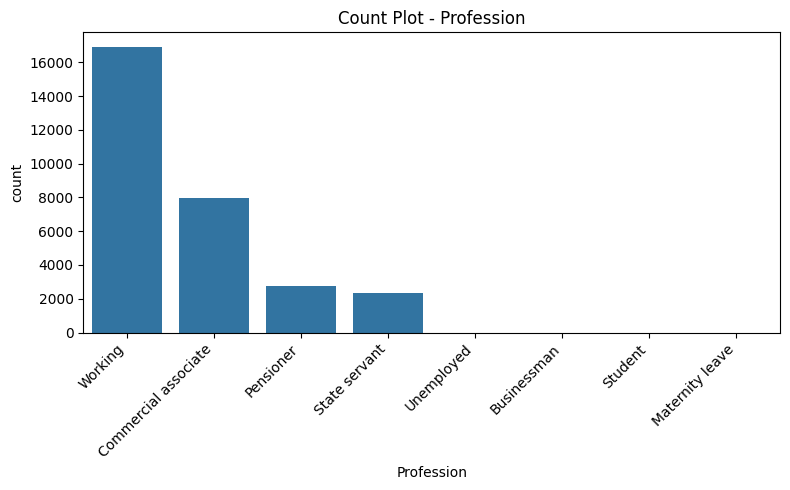
    


    
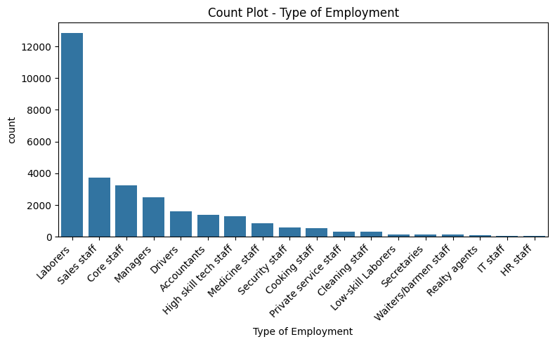
    


    
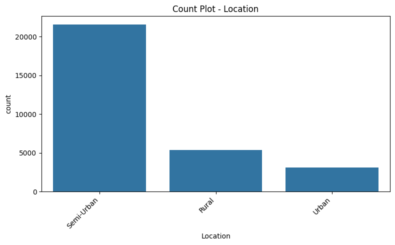
    


    
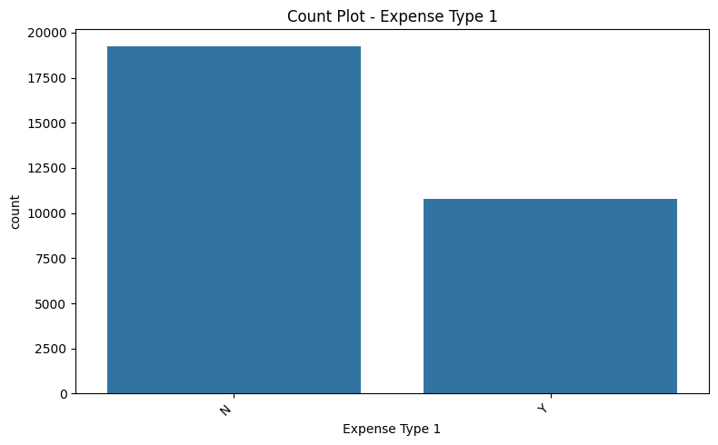
    


    
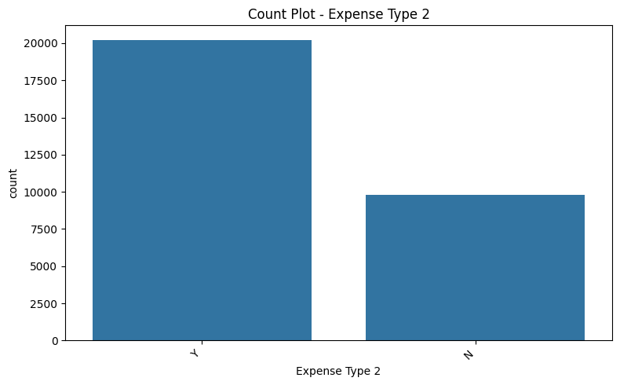
    


    
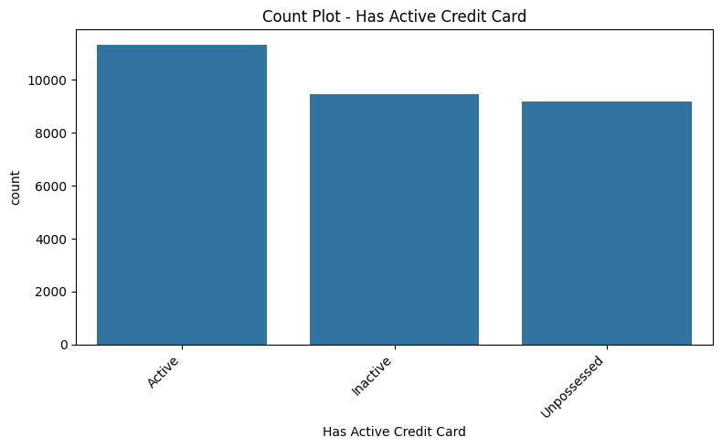
    


    
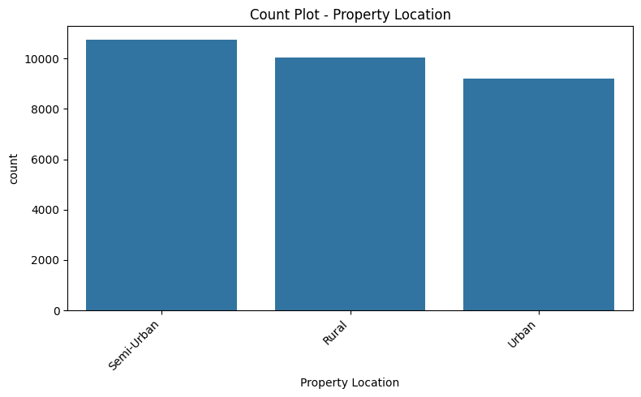
    


    ------------------------------------------------------------
    CATEGORICAL ENCODING
    Skipping Customer ID because it has too many categories.
    Skipping Name because it has too many categories.
    Gender: Binary encoding -> {'F': 0, 'M': 1}
    Income Stability: Binary encoding -> {'Low': 0, 'High': 1}
    Profession: One-hot encoded 
    8 categories
    Type of Employment: One-hot encoded 
    18 categories
    Location: One-hot encoded 
    3 categories
    Expense Type 1: Binary encoding -> {'N': 0, 'Y': 1}
    Expense Type 2: Binary encoding -> {'N': 0, 'Y': 1}
    Has Active Credit Card: One-hot encoded 
    3 categories
    Property Location: One-hot encoded 
    3 categories
    ------------------------------------------------------------
    FINAL DATASET
    Final dimensions: (30000, 49)
    Remaining columns:
    ['Customer ID', 'Name', 'Gender', 'Age', 'Income (USD)', 'Income Stability', 'Loan Amount Request (USD)', 'Current Loan Expenses (USD)', 'Expense Type 1', 'Expense Type 2', 'Dependents', 'Credit Score', 'No. of Defaults', 'Property ID', 'Property Age', 'Property Type', 'Co-Applicant', 'Property Price', 'Loan Sanction Amount (USD)', 'Profession_Commercial associate', 'Profession_Maternity leave', 'Profession_Pensioner', 'Profession_State servant', 'Profession_Student', 'Profession_Unemployed', 'Profession_Working', 'Type of Employment_Cleaning staff', 'Type of Employment_Cooking staff', 'Type of Employment_Core staff', 'Type of Employment_Drivers', 'Type of Employment_HR staff', 'Type of Employment_High skill tech staff', 'Type of Employment_IT staff', 'Type of Employment_Laborers', 'Type of Employment_Low-skill Laborers', 'Type of Employment_Managers', 'Type of Employment_Medicine staff', 'Type of Employment_Private service staff', 'Type of Employment_Realty agents', 'Type of Employment_Sales staff', 'Type of Employment_Secretaries', 'Type of Employment_Security staff', 'Type of Employment_Waiters/barmen staff', 'Location_Semi-Urban', 'Location_Urban', 'Has Active Credit Card_Inactive', 'Has Active Credit Card_Unpossessed', 'Property Location_Semi-Urban', 'Property Location_Urban']
    Remaining missing values:
    Customer ID                                 0
    Name                                        0
    Gender                                      0
    Age                                         0
    Income (USD)                                0
    Income Stability                            0
    Loan Amount Request (USD)                   0
    Current Loan Expenses (USD)                 0
    Expense Type 1                              0
    Expense Type 2                              0
    Dependents                                  0
    Credit Score                                0
    No. of Defaults                             0
    Property ID                                 0
    Property Age                                0
    Property Type                               0
    Co-Applicant                                0
    Property Price                              0
    Loan Sanction Amount (USD)                  0
    Profession_Commercial associate             0
    Profession_Maternity leave                  0
    Profession_Pensioner                        0
    Profession_State servant                    0
    Profession_Student                          0
    Profession_Unemployed                       0
    Profession_Working                          0
    Type of Employment_Cleaning staff           0
    Type of Employment_Cooking staff            0
    Type of Employment_Core staff               0
    Type of Employment_Drivers                  0
    Type of Employment_HR staff                 0
    Type of Employment_High skill tech staff    0
    Type of Employment_IT staff                 0
    Type of Employment_Laborers                 0
    Type of Employment_Low-skill Laborers       0
    Type of Employment_Managers                 0
    Type of Employment_Medicine staff           0
    Type of Employment_Private service staff    0
    Type of Employment_Realty agents            0
    Type of Employment_Sales staff              0
    Type of Employment_Secretaries              0
    Type of Employment_Security staff           0
    Type of Employment_Waiters/barmen staff     0
    Location_Semi-Urban                         0
    Location_Urban                              0
    Has Active Credit Card_Inactive             0
    Has Active Credit Card_Unpossessed          0
    Property Location_Semi-Urban                0
    Property Location_Urban                     0
    dtype: int64
    Final dataframe:
      Customer ID               Name  Gender       Age  Income (USD)  \
    0     C-36995   Frederica Shealy       0  0.991451     -0.417049   
    1     C-33999  America Calderone       1 -0.504355     -0.042318   
    2      C-3770      Rosetta Verne       0  1.552379     -1.640571   
    3     C-26480         Zoe Chitty       0  1.552379     -0.042318   
    4     C-23459       Afton Venema       0 -0.566680      0.465726   
    
       Income Stability  Loan Amount Request (USD)  Current Loan Expenses (USD)  \
    0                 0                  -0.214945                    -0.826019   
    1                 0                  -0.726098                     0.571039   
    2                 1                  -0.750589                    -1.205160   
    3                 1                  -0.072292                    -0.510882   
    4                 0                   0.592939                     0.546908   
    
       Expense Type 1  Expense Type 2  ...  Type of Employment_Sales staff  \
    0               0               0  ...                               1   
    1               0               1  ...                               0   
    2               0               1  ...                               0   
    3               0               1  ...                               0   
    4               0               1  ...                               0   
    
       Type of Employment_Secretaries  Type of Employment_Security staff  \
    0                               0                                  0   
    1                               0                                  0   
    2                               0                                  0   
    3                               0                                  0   
    4                               0                                  0   
    
       Type of Employment_Waiters/barmen staff  Location_Semi-Urban  \
    0                                        0                    1   
    1                                        0                    1   
    2                                        0                    1   
    3                                        0                    0   
    4                                        0                    1   
    
       Location_Urban  Has Active Credit Card_Inactive  \
    0               0                                0   
    1               0                                0   
    2               0                                0   
    3               0                                0   
    4               0                                0   
    
       Has Active Credit Card_Unpossessed  Property Location_Semi-Urban  \
    0                                   0                             0   
    1                                   1                             0   
    2                                   1                             0   
    3                                   1                             1   
    4                                   0                             1   
    
       Property Location_Urban  
    0                        0  
    1                        0  
    2                        1  
    3                        0  
    4                        0  
    
    [5 rows x 49 columns]
    

## 2. Train and Test split on dataset


```python
from sklearn.model_selection import train_test_split
x = df.drop(columns= ["Loan Sanction Amount (USD)","Customer ID","Name"])
y = df["Loan Sanction Amount (USD)"]
x_train,x_test,y_train,y_test = train_test_split(x,y,test_size=0.2,random_state=42)

```

## 3. Training Baseline Linear Regression, Ridge, Lasso and Elastic Net models


```python
from sklearn.linear_model import LinearRegression, Ridge, Lasso, ElasticNet
import time

from sklearn.metrics import mean_absolute_error
from sklearn.metrics import  mean_squared_error
from sklearn.metrics import  r2_score

start_time = time.time()
linear_model = LinearRegression()
linear_model.fit(x_train, y_train)
training_time_lin = time.time() - start_time
y_pred_lin = linear_model.predict(x_test)
mae = mean_absolute_error(y_test, y_pred_lin)
mse = mean_squared_error(y_test, y_pred_lin)
rmse = np.sqrt(mse)
r2 = r2_score(y_test, y_pred_lin)

print("MAE of Baseline Linear Regression:", mae)
print("MSE of Baseline Linear Regression:", mse)
print("RMSE of Baseline Linear Regression:", rmse)
print("R2 Score of Baseline Linear Regression:", r2)
print("Training Time of Baseline Linear Regression::", training_time_lin, "seconds")

# 2. Ridge Regression
start_time = time.time()
ridge_model = Ridge(alpha=1.0)
ridge_model.fit(x_train, y_train)
training_time_rid = time.time() - start_time
y_pred_rid = ridge_model.predict(x_test)
mae = mean_absolute_error(y_test, y_pred_rid)
mse = mean_squared_error(y_test, y_pred_rid)
rmse = np.sqrt(mse)
r2 = r2_score(y_test, y_pred_rid)

print("MAE of Ridge Regression:", mae)
print("MSE of Ridge Regression:", mse)
print("RMSE of Ridge Regression:", rmse)
print("R2 Score of Ridge Regression:", r2)
print("Training Time of Ridge Regression:", training_time_rid, "seconds")

# 3. Lasso Regression
start_time = time.time()
lasso_model = Lasso(alpha=0.1, max_iter=10000)
lasso_model.fit(x_train, y_train)
training_time_las = time.time() - start_time
y_pred_las = lasso_model.predict(x_test)
mae = mean_absolute_error(y_test, y_pred_las)
mse = mean_squared_error(y_test, y_pred_las)
rmse = np.sqrt(mse)
r2 = r2_score(y_test, y_pred_las)

print("MAE of Lasso Regression:", mae)
print("MSE of Lasso Regression:", mse)
print("RMSE of Lasso Regression:", rmse)
print("R2 Score of Lasso Regression:", r2)
print("Training Time of Lasso Regression:", training_time_las, "seconds")

# 4. Elastic Net Regression
start_time = time.time()
elastic_model = ElasticNet(alpha=0.1, l1_ratio=0.5, max_iter=10000)
elastic_model.fit(x_train, y_train)
training_time_elastic = time.time() - start_time
y_pred_elastic = elastic_model.predict(x_test)
mae = mean_absolute_error(y_test, y_pred_elastic)
mse = mean_squared_error(y_test, y_pred_elastic)
rmse = np.sqrt(mse)
r2 = r2_score(y_test, y_pred_elastic)

print("MAE of Elastic Net Regression:", mae)
print("MSE of Elastic Net Regression:", mse)
print("RMSE of Elastic Net Regression:", rmse)
print("R2 Score of Elastic Net Regression:", r2)
print("Training Time of Elastic Net Regression:", training_time_elastic, "seconds")

```

    MAE of Baseline Linear Regression: 0.5001726028595054
    MSE of Baseline Linear Regression: 0.5075965096885172
    RMSE of Baseline Linear Regression: 0.712458075740964
    R2 Score of Baseline Linear Regression: 0.4904117674047649
    Training Time of Baseline Linear Regression:: 0.07241344451904297 seconds
    MAE of Ridge Regression: 0.5001690984409025
    MSE of Ridge Regression: 0.5075927323362965
    RMSE of Ridge Regression: 0.7124554248065604
    R2 Score of Ridge Regression: 0.4904155595786772
    Training Time of Ridge Regression: 0.016880273818969727 seconds
    MAE of Lasso Regression: 0.5237930057246769
    MSE of Lasso Regression: 0.5261085566275657
    RMSE of Lasso Regression: 0.7253334106654441
    R2 Score of Lasso Regression: 0.47182708232255544
    Training Time of Lasso Regression: 0.07427740097045898 seconds
    MAE of Elastic Net Regression: 0.5139698346248848
    MSE of Elastic Net Regression: 0.5135460484196741
    RMSE of Elastic Net Regression: 0.7166212726536061
    R2 Score of Elastic Net Regression: 0.48443888368925714
    Training Time of Elastic Net Regression: 0.09121561050415039 seconds
    

## 4. Training Ridge, Lasso, Elastic Net models using GridsearchCV and RandomsearchCV  


```python
from sklearn.model_selection import GridSearchCV, RandomizedSearchCV
# Ridge using GridSearchCV
ridge_params = {"alpha": [0.01, 0.1, 1, 10, 100]}
start_time = time.time()
grid_ridge = GridSearchCV(Ridge(),ridge_params,cv=5,scoring="neg_mean_squared_error")
grid_ridge.fit(x_train, y_train)
training_time_grid_ridge = time.time() - start_time
y_pred_grid_ridge = grid_ridge.predict(x_test)
mae_grid_ridge = mean_absolute_error(y_test, y_pred_grid_ridge)
mse_grid_ridge = mean_squared_error(y_test, y_pred_grid_ridge)
rmse_grid_ridge = np.sqrt(mse_grid_ridge)
r2_grid_ridge = r2_score(y_test, y_pred_grid_ridge)

print("\nGRID SEARCH - RIDGE")
print("Best Parameters:", grid_ridge.best_params_)
print("MAE:", mae_grid_ridge)
print("MSE:", mse_grid_ridge)
print("RMSE:", rmse_grid_ridge)
print("R2 Score:", r2_grid_ridge)
print("Training Time:", training_time_grid_ridge, "seconds")


# Lasso using GridSearchCV

lasso_params = {"alpha": [0.001, 0.01, 0.1, 1, 10]}
start_time = time.time()
grid_lasso = GridSearchCV(Lasso(max_iter=10000),lasso_params,cv=5,scoring="neg_mean_squared_error")
grid_lasso.fit(x_train, y_train)
training_time_grid_lasso = time.time() - start_time
y_pred_grid_lasso = grid_lasso.predict(x_test)
mae_grid_lasso = mean_absolute_error(y_test, y_pred_grid_lasso)
mse_grid_lasso = mean_squared_error(y_test, y_pred_grid_lasso)
rmse_grid_lasso = np.sqrt(mse_grid_lasso)
r2_grid_lasso = r2_score(y_test, y_pred_grid_lasso)

print("\nGRID SEARCH - LASSO")
print("Best Parameters:", grid_lasso.best_params_)
print("MAE:", mae_grid_lasso)
print("MSE:", mse_grid_lasso)
print("RMSE:", rmse_grid_lasso)
print("R2 Score:", r2_grid_lasso)
print("Training Time:", training_time_grid_lasso, "seconds")


# Elastic Net using GridSearchCV

elastic_params = {"alpha": [0.01, 0.1, 1, 10],"l1_ratio": [0.2, 0.5, 0.8]}
start_time = time.time()
grid_elastic = GridSearchCV(ElasticNet(max_iter=10000),elastic_params,cv=5,scoring="neg_mean_squared_error")
grid_elastic.fit(x_train, y_train)
training_time_grid_elastic = time.time() - start_time
y_pred_grid_elastic = grid_elastic.predict(x_test)
mae_grid_elastic = mean_absolute_error(y_test, y_pred_grid_elastic)
mse_grid_elastic = mean_squared_error(y_test, y_pred_grid_elastic)
rmse_grid_elastic = np.sqrt(mse_grid_elastic)
r2_grid_elastic = r2_score(y_test, y_pred_grid_elastic)

print("\nGRID SEARCH - ELASTIC NET")
print("Best Parameters:", grid_elastic.best_params_)
print("MAE:", mae_grid_elastic)
print("MSE:", mse_grid_elastic)
print("RMSE:", rmse_grid_elastic)
print("R2 Score:", r2_grid_elastic)
print("Training Time:", training_time_grid_elastic, "seconds")

# Ridge using RandomSearchCV

start_time = time.time()
random_ridge = RandomizedSearchCV(Ridge(),ridge_params,n_iter=5,cv=5,scoring="neg_mean_squared_error",random_state=42)
random_ridge.fit(x_train, y_train)
training_time_random_ridge = time.time() - start_time
y_pred_random_ridge = random_ridge.predict(x_test)
mae_random_ridge = mean_absolute_error(y_test,y_pred_random_ridge)
mse_random_ridge = mean_squared_error(y_test,y_pred_random_ridge)
rmse_random_ridge = np.sqrt(mse_random_ridge)
r2_random_ridge = r2_score(y_test,y_pred_random_ridge)

print("\nRANDOMIZED SEARCH - RIDGE")
print("Best Parameters:", random_ridge.best_params_)
print("MAE:", mae_random_ridge)
print("MSE:", mse_random_ridge)
print("RMSE:", rmse_random_ridge)
print("R2 Score:", r2_random_ridge)
print("Training Time:", training_time_random_ridge, "seconds")


# Lasso using Random Search CV

start_time = time.time()
random_lasso = RandomizedSearchCV(Lasso(max_iter=10000),lasso_params,n_iter=5,cv=5,scoring="neg_mean_squared_error",random_state=42)
random_lasso.fit(x_train, y_train)
training_time_random_lasso = time.time() - start_time
y_pred_random_lasso = random_lasso.predict(x_test)
mae_random_lasso = mean_absolute_error(y_test,y_pred_random_lasso)
mse_random_lasso = mean_squared_error(y_test,y_pred_random_lasso)
rmse_random_lasso = np.sqrt(mse_random_lasso)
r2_random_lasso = r2_score(y_test,y_pred_random_lasso)

print("\nRANDOMIZED SEARCH - LASSO")
print("Best Parameters:", random_lasso.best_params_)
print("MAE:", mae_random_lasso)
print("MSE:", mse_random_lasso)
print("RMSE:", rmse_random_lasso)
print("R2 Score:", r2_random_lasso)
print("Training Time:", training_time_random_lasso, "seconds")


# Elastic net using RandomSearchCV

start_time = time.time()
random_elastic = RandomizedSearchCV(ElasticNet(max_iter=10000),elastic_params,n_iter=12,cv=5,scoring="neg_mean_squared_error",random_state=42) 
random_elastic.fit(x_train, y_train)
training_time_random_elastic = time.time() - start_time
y_pred_random_elastic = random_elastic.predict(x_test)
mae_random_elastic = mean_absolute_error(y_test,y_pred_random_elastic)
mse_random_elastic = mean_squared_error(y_test,y_pred_random_elastic)
rmse_random_elastic = np.sqrt(mse_random_elastic)
r2_random_elastic = r2_score(y_test,y_pred_random_elastic)

print("\nRANDOMIZED SEARCH - ELASTIC NET")
print("Best Parameters:", random_elastic.best_params_)
print("MAE:", mae_random_elastic)
print("MSE:", mse_random_elastic)
print("RMSE:", rmse_random_elastic)
print("R2 Score:", r2_random_elastic)
print("Training Time:", training_time_random_elastic, "seconds")
```

    
    GRID SEARCH - RIDGE
    Best Parameters: {'alpha': 100}
    MAE: 0.5002386081024391
    MSE: 0.5071941964198596
    RMSE: 0.7121756780597465
    R2 Score: 0.490815659282687
    Training Time: 0.5380463600158691 seconds
    
    GRID SEARCH - LASSO
    Best Parameters: {'alpha': 0.001}
    MAE: 0.49994815527002806
    MSE: 0.5072653902810248
    RMSE: 0.7122256596620378
    R2 Score: 0.4907441860688444
    Training Time: 4.881348371505737 seconds
    
    GRID SEARCH - ELASTIC NET
    Best Parameters: {'alpha': 0.01, 'l1_ratio': 0.2}
    MAE: 0.5009895153763609
    MSE: 0.5066325629259856
    RMSE: 0.7117812605892245
    R2 Score: 0.49137949653146007
    Training Time: 5.851212978363037 seconds
    
    RANDOMIZED SEARCH - RIDGE
    Best Parameters: {'alpha': 100}
    MAE: 0.5002386081024391
    MSE: 0.5071941964198596
    RMSE: 0.7121756780597465
    R2 Score: 0.490815659282687
    Training Time: 0.5129718780517578 seconds
    
    RANDOMIZED SEARCH - LASSO
    Best Parameters: {'alpha': 0.001}
    MAE: 0.49994815527002806
    MSE: 0.5072653902810248
    RMSE: 0.7122256596620378
    R2 Score: 0.4907441860688444
    Training Time: 4.90628719329834 seconds
    
    RANDOMIZED SEARCH - ELASTIC NET
    Best Parameters: {'l1_ratio': 0.2, 'alpha': 0.01}
    MAE: 0.5009895153763609
    MSE: 0.5066325629259856
    RMSE: 0.7117812605892245
    R2 Score: 0.49137949653146007
    Training Time: 5.545600652694702 seconds
    

## 5. Visualizations


```python
import matplotlib.pyplot as plt
import seaborn as sns

# Predicted vs actual values

plt.figure(figsize=(8, 6))
sns.scatterplot(x=y_test,y=y_pred_lin,alpha=0.5)
plt.plot([y_test.min(), y_test.max()],[y_test.min(), y_test.max()],linestyle="--")
plt.title("Predicted vs Actual - Linear Regression")
plt.xlabel("Actual Values")
plt.ylabel("Predicted Values")
plt.tight_layout()
plt.show()
plt.figure(figsize=(8, 6))
sns.scatterplot(x=y_test,y=y_pred_grid_ridge,alpha=0.5)
plt.plot([y_test.min(), y_test.max()],[y_test.min(), y_test.max()],linestyle="--")
plt.title("Predicted vs Actual - Tuned Ridge Regression")
plt.xlabel("Actual Values")
plt.ylabel("Predicted Values")
plt.tight_layout()
plt.show()
plt.figure(figsize=(8, 6))
sns.scatterplot(x=y_test,y=y_pred_grid_lasso,alpha=0.5)
plt.plot([y_test.min(), y_test.max()],[y_test.min(), y_test.max()],linestyle="--")
plt.title("Predicted vs Actual - Tuned Lasso Regression")
plt.xlabel("Actual Values")
plt.ylabel("Predicted Values")
plt.tight_layout()
plt.show()
plt.figure(figsize=(8, 6))
sns.scatterplot(x=y_test,y=y_pred_grid_elastic,alpha=0.5)
plt.plot([y_test.min(), y_test.max()],[y_test.min(), y_test.max()],linestyle="--")
plt.title("Predicted vs Actual - Tuned Elastic Net")
plt.xlabel("Actual Values")
plt.ylabel("Predicted Values")
plt.tight_layout()
plt.show()

# Residual Plots

residual_lin = y_test - y_pred_lin
residual_grid_ridge = y_test - y_pred_grid_ridge
residual_grid_lasso = y_test - y_pred_grid_lasso
residual_grid_elastic = y_test - y_pred_grid_elastic


plt.figure(figsize=(8, 6))
sns.scatterplot(x=y_pred_lin,y=residual_lin,alpha=0.5)
plt.axhline(0,linestyle="--")
plt.title("Residual Plot - Linear Regression")
plt.xlabel("Predicted Values")
plt.ylabel("Residuals")
plt.tight_layout()
plt.show()
plt.figure(figsize=(8, 6))
sns.scatterplot(x=y_pred_grid_ridge,y=residual_grid_ridge,alpha=0.5)
plt.axhline(0,linestyle="--")
plt.title("Residual Plot - Tuned Ridge Regression")
plt.xlabel("Predicted Values")
plt.ylabel("Residuals")
plt.tight_layout()
plt.show()
plt.figure(figsize=(8, 6))
sns.scatterplot(x=y_pred_grid_lasso,y=residual_grid_lasso,alpha=0.5)
plt.axhline(0,linestyle="--")
plt.title("Residual Plot - Tuned Lasso Regression")
plt.xlabel("Predicted Values")
plt.ylabel("Residuals")
plt.tight_layout()
plt.show()
plt.figure(figsize=(8, 6))
sns.scatterplot(x=y_pred_grid_elastic,y=residual_grid_elastic,alpha=0.5)
plt.axhline(0,linestyle="--")
plt.title("Residual Plot - Tuned Elastic Net")
plt.xlabel("Predicted Values")
plt.ylabel("Residuals")
plt.tight_layout()
plt.show()

# Training error vs Validation error

train_pred_lin = linear_model.predict(x_train)
train_pred_grid_ridge = grid_ridge.predict(x_train)
train_pred_grid_lasso = grid_lasso.predict(x_train)
train_pred_grid_elastic = grid_elastic.predict(x_train)


train_rmse_lin = np.sqrt(mean_squared_error(y_train, train_pred_lin))
train_rmse_grid_ridge = np.sqrt(mean_squared_error(y_train, train_pred_grid_ridge))
train_rmse_grid_lasso = np.sqrt(mean_squared_error(y_train, train_pred_grid_lasso))
train_rmse_grid_elastic = np.sqrt(mean_squared_error(y_train, train_pred_grid_elastic))
validation_rmse_lin = np.sqrt(mean_squared_error(y_test, y_pred_lin))
validation_rmse_grid_ridge = np.sqrt(mean_squared_error(y_test, y_pred_grid_ridge))
validation_rmse_grid_lasso = np.sqrt(mean_squared_error(y_test, y_pred_grid_lasso))
validation_rmse_grid_elastic = np.sqrt(mean_squared_error(y_test, y_pred_grid_elastic))
models = ["Linear Regression","Grid Ridge","Grid Lasso","Grid Elastic Net"]
training_errors = [train_rmse_lin,train_rmse_grid_ridge,train_rmse_grid_lasso,train_rmse_grid_elastic]
validation_errors = [validation_rmse_lin,validation_rmse_grid_ridge,validation_rmse_grid_lasso,validation_rmse_grid_elastic]
x = np.arange(len(models))
width = 0.35
plt.figure(figsize=(10, 6))
plt.bar(x - width / 2,training_errors,width,label="Training RMSE")
plt.bar(x + width / 2,validation_errors,width,label="Validation RMSE")
plt.xticks(x,models,rotation=15)
plt.ylabel("RMSE")
plt.xlabel("Model")
plt.title("Training Error vs Validation Error")
plt.legend()
plt.tight_layout()
plt.show()

# Coefficient Comparison

coefficient_df = pd.DataFrame({
    "Linear Regression": linear_model.coef_,
    "Grid Ridge": grid_ridge.best_estimator_.coef_,
    "Grid Lasso": grid_lasso.best_estimator_.coef_,
    "Grid Elastic Net": grid_elastic.best_estimator_.coef_
})
coefficient_df.index = x_train.columns
coefficient_df.plot(kind="bar",figsize=(14, 7))
plt.title("Coefficient Comparison")
plt.xlabel("Features")
plt.ylabel("Coefficient Value")
plt.xticks(rotation=75)
plt.legend()
plt.tight_layout()
plt.show()

```


    
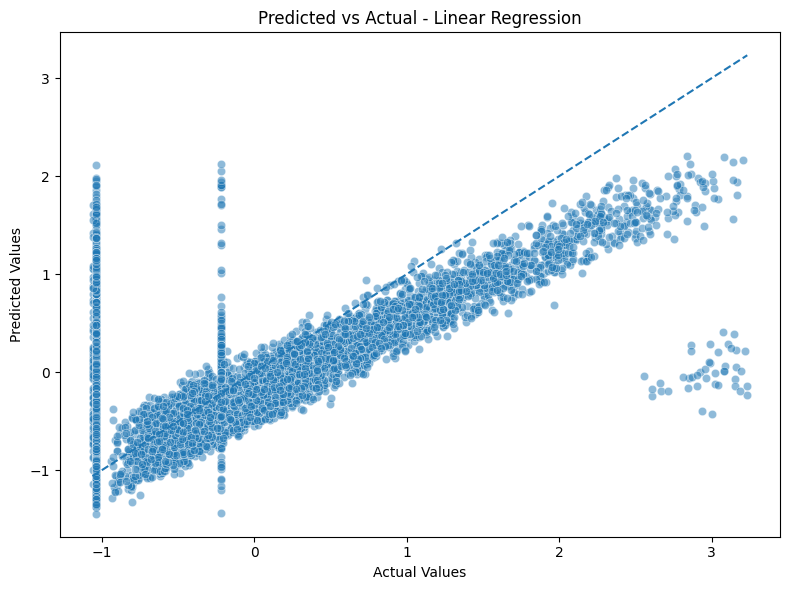
    


    
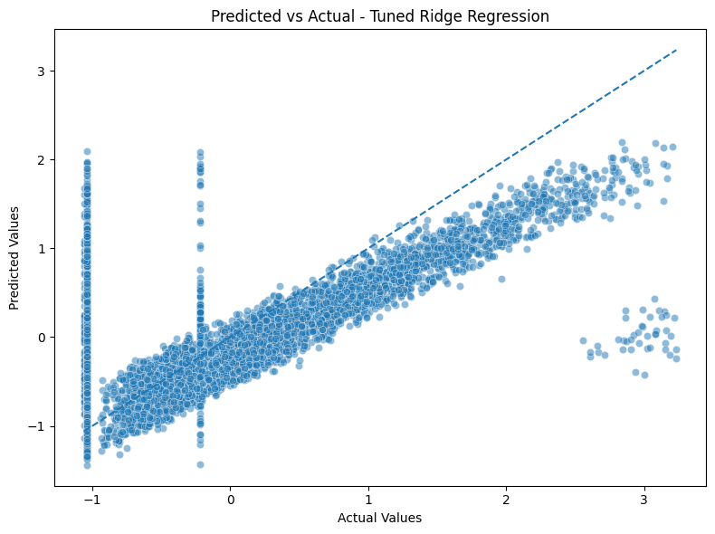
    


    

    


    
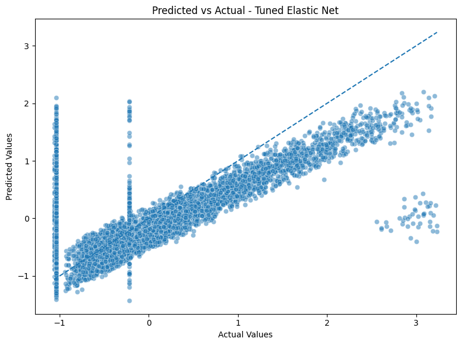
    


    

    


    
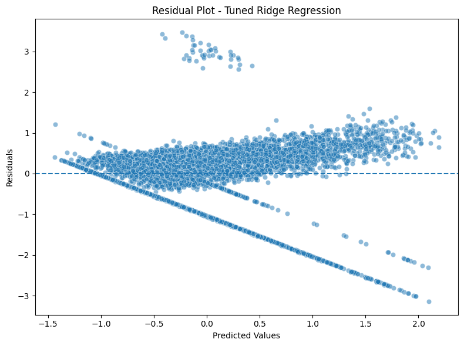
    


    
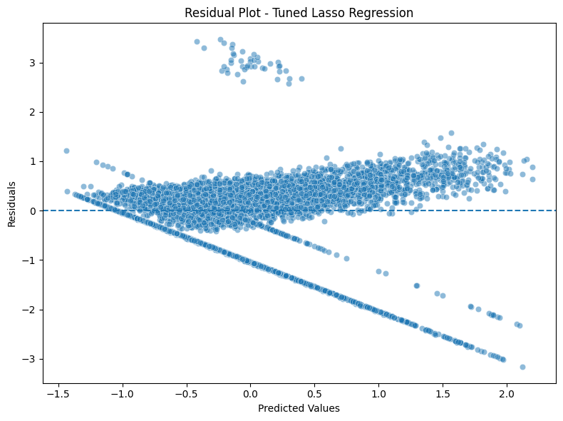
    


    
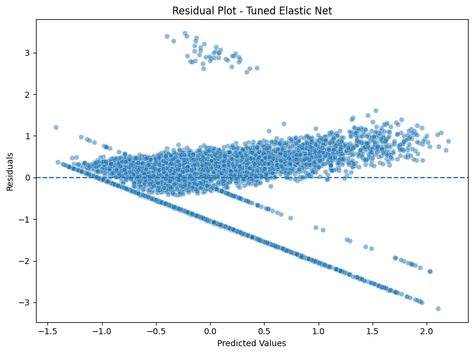
    


    
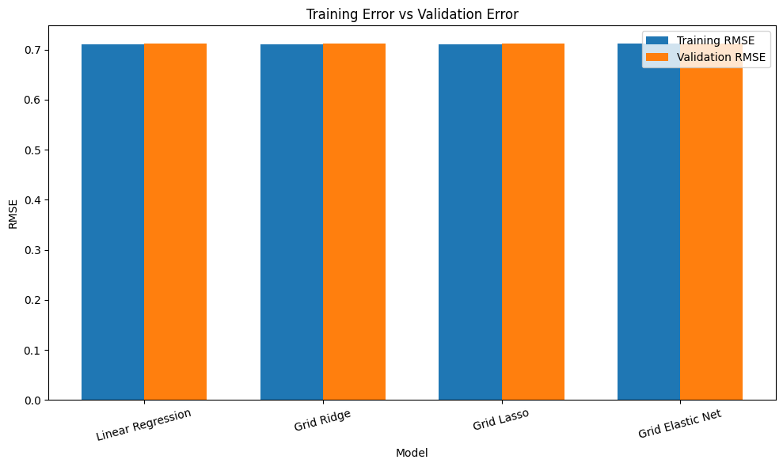
    


    
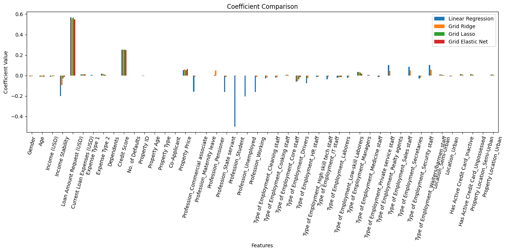
    

